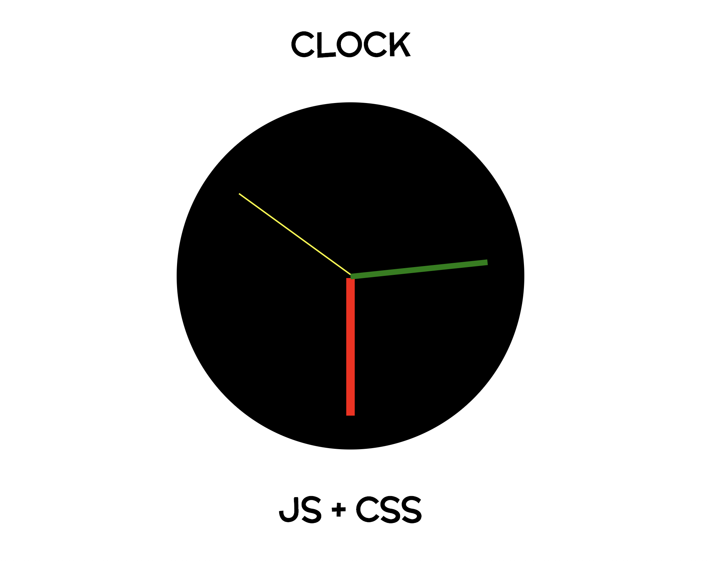

# clock

A clock made with JavaScript and CSS, HTML

Watch it here https://isa2008.github.io/drum-kit/

By pushing a key down [ASDFGHJKL], a sound will appear and its button on screen lightens up. The user can rewind to starting sound of a key by hitting several times. Displayed in flexbox.

Based on a course of https://javascript30.com/
